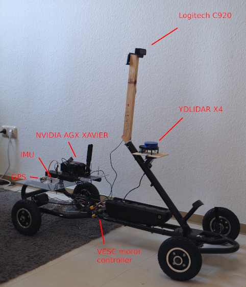
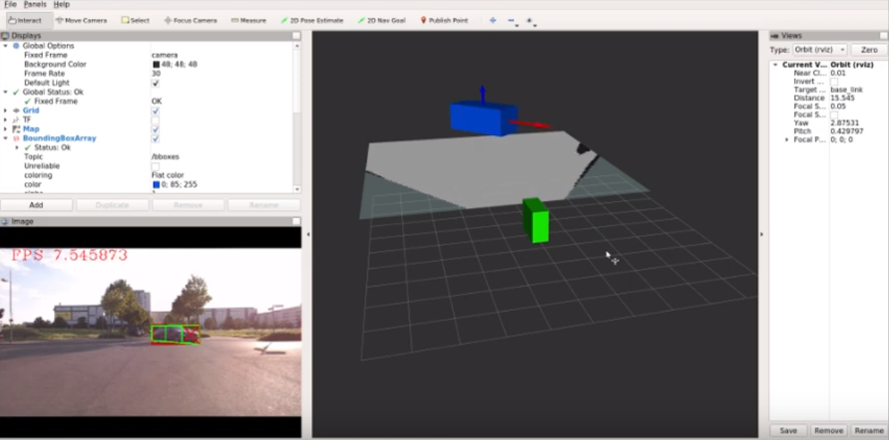
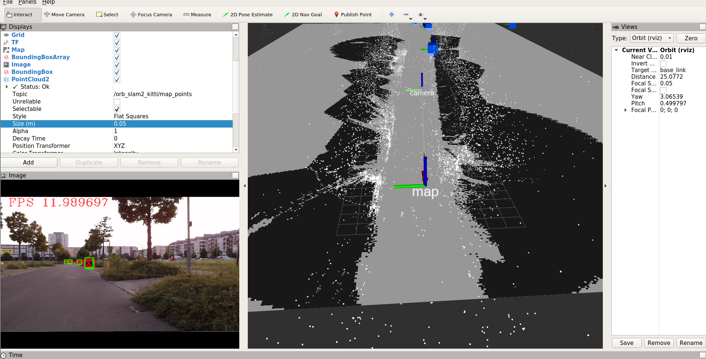

# eagle2
Self-driving gokart

Status: **Still in WIP**
- hardware and drive-by-wire modules **done**
- perception **done**
- mapping and localization **done**
- navigation **in progress**
- obstacles tracking
- first autonomous run

TODOs:
- semantic map and line recognition
- traffic signs recognition
- 360 view camera module (wanted [e-consystems KitSurveilsQUAD](https://www.e-consystems.com/nvidia-cameras/jetson-agx-xavier-cameras/sony-starvis-imx290-synchronized-multi-camera.asp))
- obstacles prediction
- ROS2

# Perception

Allows car to see road, other cars, pedestrians and few other object types (VOC dataset) in 3D space.

Perception module uses only one monocular camera (Logitech c920) as a sensor and three neural networks:
1. Drivable area segmentation. Used ["bonnet"](https://github.com/PRBonn/bonnet) segmentation network.
2. Object detection. Used [Yolo v3](https://pjreddie.com/media/files/papers/YOLOv3.pdf).
3. 2D to 3D bounding box estimation. Used ["3D Bounding Box Estimation"](https://arxiv.org/abs/1612.00496).

All three networks are TensorRT, which allows significantly improve performance (~5x compared to TensorFlow). Perception module split into two nodes: camera and perception pipeline node. In order, to reproject objects to top down view one should get homography matrix with [calibrate.py](misc/calibrate.py). One of the limitations with monocular camera that we assume ground is always flat.

Pretrained weights [here](https://drive.google.com/open?id=1uLVdngRzldyHbaT1a0dGptiZ_D5YkbTh).

# Localization and Mapping

Allows car to build a map and localize itself on this map. [ORB SLAM2](https://github.com/raulmur/ORB_SLAM2) is used as core alghoritm. First car should drive multiple loops in the target area and collect a video stream. Then offline, based only on video stream, ORB SLAM2 builds own map of environment (point cloud). Second step is to build occupancy grid-like map of area. To do that one should use [build_map.py](misc/build_map.py) script together with perception module (all can be done offline). If everything went well, script should save `map.png` which can be used with ROS map_server. NOTE: map is just occupancy grid map without any semantics (e.g. traffic signs, parking lots, speed limits).

At runtime one should run ORB SLAM in localize only mode. Because ORB SLAM is not always robust and someetimes loses tracking, eagle2 uses robot_localization package (Extended Kalman Filter) that fuses together values from ORB SLAM, odometry and IMU.

# credits

- 3D Bounding Box Estimation ([paper](https://arxiv.org/abs/1612.00496), [code](https://github.com/cersar/3D_detection)).
- Yolo V3 - object detection - ([paper](https://pjreddie.com/media/files/papers/YOLOv3.pdf), [TensorRT code](https://github.com/lewes6369/TensorRT-Yolov3)).
- Bonnet - semantic segmentation - ([code](https://github.com/PRBonn/bonnet)).
- ORB SLAM 2 ([orig.code](https://github.com/raulmur/ORB_SLAM2), [ROS code](https://github.com/appliedAI-Initiative/orb_slam_2_ros))
